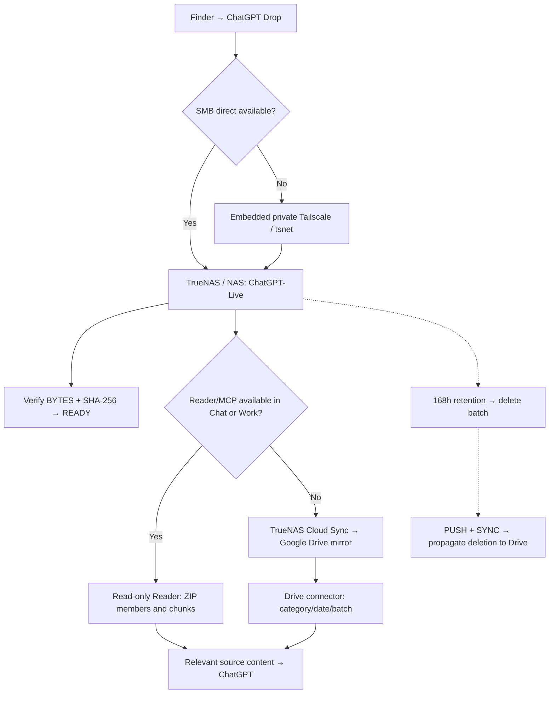

# ChatGPT-TrueNAS
### ChatGPT Drop · macOS client · Proprietary project

**Send files once. Keep the full bytes in storage you control. Let ChatGPT read only the relevant content.**

[Română](README.ro.md) · [Why we built it](docs/ORIGIN.md) · [Route diagrams](docs/ROUTES.md) · [Set up storage](docs/SETUP.md) · [Chat/Work handover](docs/HANDOVER.md) · [History](HISTORY.md) · [Rights and security](docs/RIGHTS.md) · [Credits](docs/CREDITS.md)

**ChatGPT-TrueNAS** is the public documentation and distribution project. **ChatGPT Drop** is the Apple/macOS application's current name. This is an independent project, not an official OpenAI, Apple, GitHub, Tailscale or iXsystems product.

## Why it exists

We started with a practical problem: repeatedly uploading ZIPs, logs, code snapshots and other large files into ChatGPT conversations uses file-upload/storage allowances and duplicates the same data. The project aims to **avoid consuming ChatGPT file-upload/storage quota unnecessarily**, not to avoid consuming tokens. The original bytes still occupy the owner's NAS (and, if enabled, the Drive mirror); content retrieved for analysis still consumes model context, tool calls and tokens. No “unlimited quota” claim is made.

We examined existing file-drop/cloud integrations and attempted ways to read NAS data inside ChatGPT. Some tools or connectors appeared in Work/Codex but not ordinary Chat/Projects. A useful file-transfer mechanism was **not automatically a usable ChatGPT read path**. This led to two independent routes: verified file delivery **to storage** and controlled content access **from storage to ChatGPT**. [Read the decision history](docs/ORIGIN.md).

## Three different mechanisms — not one tunnel

| Purpose | Primary | Fallback / lifecycle |
| --- | --- | --- |
| **1. Upload from Mac** | Finder Quick Action → ChatGPT Drop → direct SMB → owner-controlled NAS | Private embedded Tailscale/tsnet → the **same** NAS SMB service when direct SMB is unavailable; failed batches remain resumable |
| **2. Read in Chat/Work** | Read-only TrueNAS Reader through an authorized MCP connector; ZIP member/chunk inspection at source | Configured Google Drive `ChatGPT Project Bridge` mirror, direct category/date/batch traversal; full object transfer only as last resort |
| **3. Clean up** | Batch UTC timestamp + 168 hours → TrueNAS scheduled cleaner | TrueNAS Cloud Sync `PUSH + SYNC` propagates deletions to Drive; retain permanent backups **outside** the expiring batch tree |

**Tailscale solves the Mac → NAS transport**, not the cloud ChatGPT → NAS reading problem. A green **READY** status proves the batch was transferred and verified; it does **not** prove that the current Chat or Work session can read it.

### Data-flow map

The three independently configured layers are **upload, content reading, and retention**. The detailed diagrams also show failure/retry and the rule against full-archive transfer by default.

[**View the three GitHub-rendered diagrams →**](docs/ROUTES.md)

## How to use the reference macOS workflow

1. Select files in Finder → **Quick Actions → Send to ChatGPT Drop**. Original files stay in place.
2. The app freezes a batch, copies to its private queue, uploads through the chosen private SMB path, uses temporary names, and validates destination **BYTES + SHA-256**. An incomplete transfer retains state for retry.
3. On success, it places **BATCH + PATH + BYTES + SHA256** in the clipboard.
4. Paste the message into Chat or Work **with Reader/MCP or Drive access enabled**. Prefer listing and reading source members/parts; do not copy a complete large ZIP into the conversation when source inspection works.
5. The server can automatically remove managed batches after **seven days**, independently from the Mac application.

[TrueNAS setup](docs/SETUP.md) · [Ordinary NAS and local-drive roadmap](docs/SETUP.md) · [Exact handover protocol for new Chat and Work](docs/HANDOVER.md)

## Current status · 8 October 2026

| Area | Verified state |
| --- | --- |
| **First public release candidate** | **ChatGPT Drop 0.9.0-rc14 V8**, Intel x86_64, Developer-ID signed; pre-release only. Check [GitHub Releases](https://github.com/StefanAlMare/ChatGPT-TrueNAS/releases) for an actual downloadable asset |
| **Verification** | RC14 V8 native build/DMG signature and integrity audit PASS. **RC14 full installation/E2E, Apple notarization and generic NAS usability not confirmed** |
| **TrueNAS Reader** | Working after correcting its read-only mount to the live `ChatGPT-Live` tree; large ZIP server-side listing/read demonstrated |
| **Seven-day retention** | **Operational on reference TrueNAS:** Cron ID 6; initial pass removed 31 expired batch directories; Drive Cloud Sync completed SUCCESS on 8 Oct |
| **Installer distribution** | Owner authorizes distributing the **exact source-bearing RC14 V8 DMG** as a **proprietary non-commercial preview**. Python source may be readable inside the DMG; **reusing it in other products is not licensed**. Publication is confirmed only when an asset is visible under [Releases](https://github.com/StefanAlMare/ChatGPT-TrueNAS/releases) |
| **Generic NAS, local/external disk, Windows, Ubuntu, Apple Silicon** | Architectural directions or unvalidated implementations; **not** advertised as finished products |

[Detailed acceptance matrix](docs/STATUS.md) · [Release artifact record](docs/RELEASE.md) · [Roadmap](docs/ROADMAP.md)

## Free to use is not open-source

**Official binaries may be used free of charge for personal, educational and other non-commercial purposes. Commercial/business use requires prior written approval**, as do repackaging, resale, redistribution, paid hosting, white-label/OEM integration and use of proprietary code in other products. The private development repository remains private. Some owner-authored Python files are readable inside this RC14 DMG: viewing them does **not** grant a source-reuse license. Third-party licenses and mandatory statutory rights remain intact.

Publishing on GitHub **does not make the product open-source**. GitHub users can view/fork public materials under GitHub's Terms. The owner expressly allows the selected RC14 V8 DMG to be distributed with visible runtime source, **without authorizing derivative code use**. Private repository content, credentials, signing keys and personal logs are not part of the publication.

[Binding terms and permissions](LICENSE.md) · [Publishing/acceptance levels](docs/RIGHTS.md) · [Security](SECURITY.md) · [Third-party notices](THIRD_PARTY_NOTICES.md)

## Project and acknowledgements

**Initiative, product direction and acceptance decisions:** [@StefanAlMare](https://github.com/StefanAlMare). **Technical research, drafting and development assistance:** ChatGPT (OpenAI), used as an AI assistant under the project owner's direction. This credit does not imply an OpenAI partnership, copyright transfer or endorsement. See [credits](docs/CREDITS.md).

**Naming notice:** “ChatGPT” is an OpenAI trademark. The current project/app names must be reviewed against [OpenAI's branding guidelines](https://openai.com/brand/) before public software distribution; no trademark permission or endorsement is claimed.

[Report a sanitized issue](https://github.com/StefanAlMare/ChatGPT-TrueNAS/issues) · [See full technical history](HISTORY.md)
