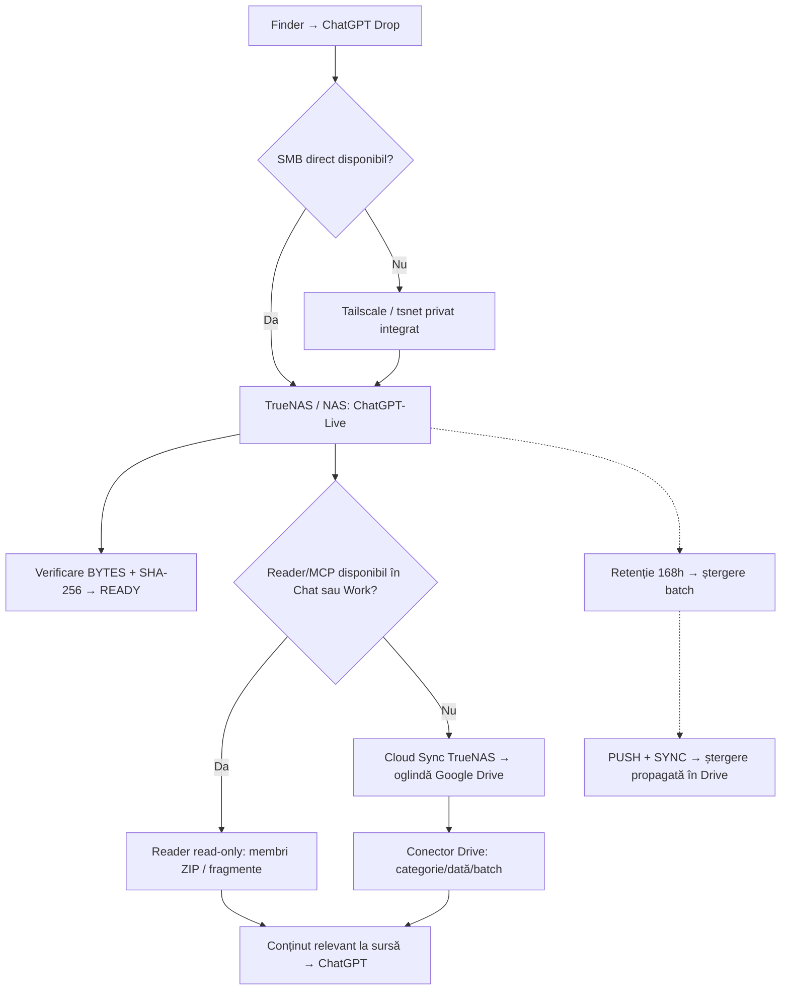

# ChatGPT-TrueNAS
### ChatGPT Drop · aplicația macOS · proiect proprietar

**Transmiți fișierele o singură dată. Datele complete rămân în stocarea ta. ChatGPT citește numai conținutul necesar.**

[English](README.md) · [De ce a apărut](docs/ORIGIN.md) · [Schemele traseelor](docs/ROUTES.md) · [Configurare](docs/SETUP.md) · [Handover Chat/Work](docs/HANDOVER.md) · [Istoric](HISTORY.md) · [Drepturi și securitate](docs/RIGHTS.md) · [Credite](docs/CREDITS.md)

**ChatGPT-TrueNAS** este proiectul public de documentație și distribuție. **ChatGPT Drop** este denumirea actuală a aplicației pentru Apple/macOS. Proiect independent, neafiliat oficial OpenAI, Apple, GitHub, Tailscale sau iXsystems.

## De ce l-am creat

Pornim de la o problemă concretă: încărcarea repetată în conversații a unor arhive ZIP mari, loguri, surse și diagnostice ocupă cota de încărcări/stocare din ChatGPT și duplică aceleași date. Dorim **să evităm consumarea inutilă a cotei de fișiere ChatGPT**, nu să eliminăm costul token-urilor. Fișierul întreg ocupă în continuare spațiu pe propriul NAS (și pe Google Drive, dacă alegem oglindirea). Fragmentele citite consumă context, apeluri de instrumente și token-uri.

Am explorat aplicații existente de tip drop/cloud și transporturi spre ChatGPT. Unele integrări puteau fi accesate în Work/Codex, dar nu în Chat obișnuit sau Projects. Am descoperit că **transferul fișierului și posibilitatea ca ChatGPT să-l citească sunt două probleme diferite**. [Istoricul deciziilor](docs/ORIGIN.md).

## Trei mecanisme distincte

| Scop | Calea principală | Alternativă |
| --- | --- | --- |
| **1. Mac → stocare** | Finder → ChatGPT Drop → SMB direct → NAS propriu | Tailscale/tsnet privat integrat → **același** SMB de pe NAS când ruta directă nu merge |
| **2. Stocare → Chat/Work** | TrueNAS Reader exclusiv citire, prin MCP autorizat; analiză ZIP pe membri/fragmente | Oglindă Google Drive `ChatGPT Project Bridge`, traversare directă categorie/dată/batch; transfer integral doar în ultimă instanță |
| **3. Ștergere după 7 zile** | ID batch UTC + 168 ore → curățare automată TrueNAS | Cloud Sync `PUSH + SYNC` propagă ștergerile în Drive; backupurile permanente se păstrează în afara arborelui temporar |

**Tailscale rezolvă transportul Mac → NAS**, nu îi oferă singur lui ChatGPT acces la SMB. **READY/verde** înseamnă doar că întregul lot a fost transferat și verificat, nu că ChatGPT l-a citit.

### Schema fluxului de date

Cele trei niveluri configurate independent sunt **transferul, citirea și retenția**. Schemele detaliate includ și tratarea erorilor, reluarea și evitarea descărcării integrale a arhivelor.

[**Vezi schemele complete, cu alternative →**](docs/ROUTES.md)

## Cum se folosește

1. Selectezi fișiere în Finder → **Quick Actions → Send to ChatGPT Drop**; originalele rămân pe loc.
2. Aplicația stabilește lotul, transferă prin SMB privat și verifică fiecare fișier la destinație prin **BYTES + SHA-256**. Întreruperile păstrează jurnalul și copiile de lucru pentru reluare.
3. La succes, pune în clipboard **BATCH + PATH + BYTES + SHA256**.
4. Lipești mesajul într-un Chat sau Work unde Reader/MCP ori Drive este conectat. Asistentul trebuie să citească membrii sau fragmentele relevante direct la sursă, nu să descarce implicit arhive întregi.
5. TrueNAS poate elimina automat batch-urile gestionate după **7 zile**, independent de aplicația de pe Mac.

[Configurare TrueNAS](docs/SETUP.md) · [NAS obișnuit / disc propriu](docs/SETUP.md) · [Protocol de predare către orice Chat sau Work](docs/HANDOVER.md)

## Stadiul real · 8 octombrie 2026

| Domeniu | Stare confirmată |
| --- | --- |
| **Versiune internă acceptată** | macOS **0.9.0-rc13**, inclusiv test cu transfer privat din afara LAN |
| **Cel mai nou candidat** | **ChatGPT Drop 0.9.0-rc14 V8**, Intel x86_64: build, semnare Developer ID și audit DMG PASS; **instalarea/E2E RC14 și notarizarea neconfirmate** |
| **TrueNAS Reader** | Funcțional după corectarea montării în `ChatGPT-Live`; inspecția ZIP-urilor mari direct pe NAS confirmată |
| **Retenție 7 zile** | **Activă pe TrueNAS de referință:** Cron ID 6; 31 de directoare expirate șterse inițial; Cloud Sync Drive SUCCESS (8 oct.) |
| **Installer public / Releases** | **Încă nu există.** DMG-ul RC14 V8 conține `chatgpt_drop.py` în clar și nu poate fi publicat neschimbat dacă sursa trebuie protejată |
| **NAS generic, disc local/extern, Windows, Ubuntu, Apple Silicon** | Direcții de dezvoltare sau implementări nevalidate, nu produse finale |

[Stadiu detaliat](docs/STATUS.md) · [Identitatea buildului](docs/RELEASE.md) · [Roadmap](docs/ROADMAP.md)

## Gratuit de utilizat ≠ open-source

Intenția este ca **oricine să poată folosi gratuit aplicația oficială compilată**, inclusiv intern într-o organizație. **Codul-sursă rămâne privat și proprietar.** Accesul la surse, modificările, proiectele derivate, redistribuirea, revânzarea, găzduirea contra cost, rebranduirea și exploatarea comercială necesită **acordul scris al titularului**. Se respectă drepturile legale obligatorii și licențele componentelor terțe.

Un repository public **nu devine automat open-source**, dar regulile GitHub permit vizualizarea și *fork*-ul conținutului pus public. De aceea nu publicăm aici sursele, secretele, jurnalele private sau DMG-ul care conține Python proprietar.

[Licență și permisiuni](LICENSE.md) · [Niveluri de securitate/acceptare](docs/RIGHTS.md) · [Politică securitate](SECURITY.md) · [Componente terțe](THIRD_PARTY_NOTICES.md)

## Credite

**Inițiativă, conducerea proiectului și decizii de acceptare:** [@StefanAlMare](https://github.com/StefanAlMare). **Asistență la cercetare, dezvoltare și redactare:** ChatGPT (OpenAI), utilizat ca asistent AI sub conducerea titularului proiectului. Mențiunea nu înseamnă parteneriat, transfer de drepturi sau susținere oficială din partea OpenAI. [Credite detaliate](docs/CREDITS.md).

**Atenție la denumire:** „ChatGPT” este marcă OpenAI. Numele actual al proiectului și al aplicației necesită evaluare în raport cu [regulile de marcă OpenAI](https://openai.com/brand/) înainte de distribuția publică a produsului.

[Trimite un raport fără date private](https://github.com/StefanAlMare/ChatGPT-TrueNAS/issues) · [Istoric integral](HISTORY.md)
