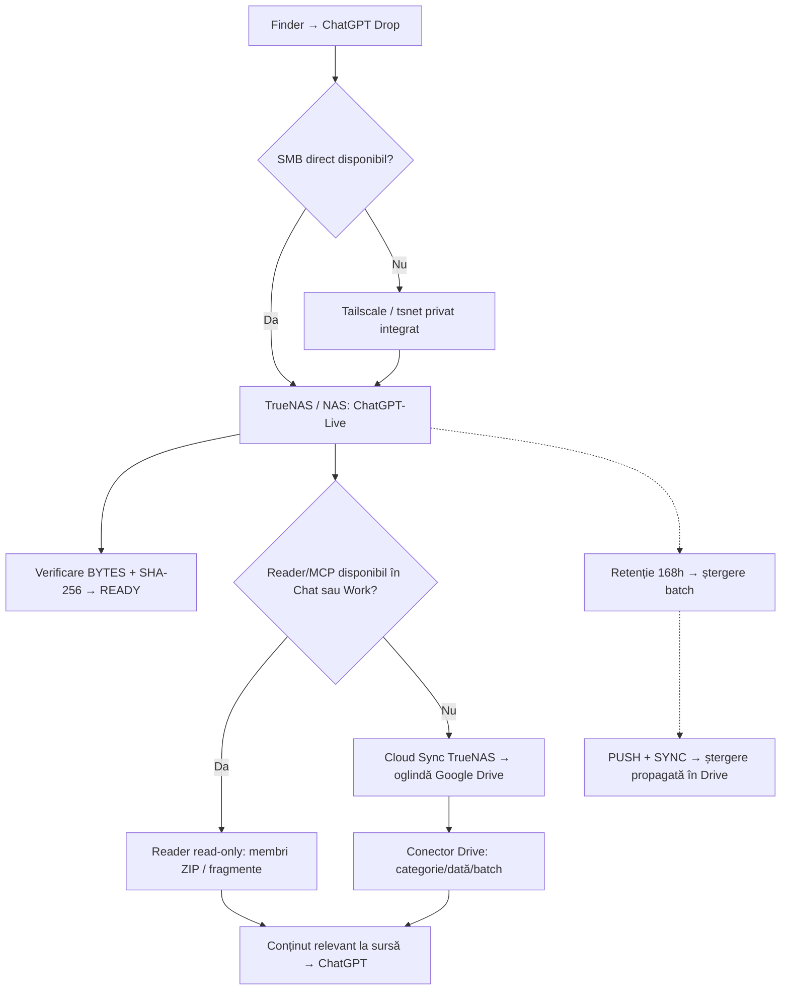

# ChatGPT-TrueNAS
### ChatGPT Drop · aplicația macOS · proiect proprietar

**Transmiți fișierele o singură dată. Datele complete rămân în stocarea ta. ChatGPT citește numai conținutul necesar.**

[English](README.md) · [De ce a apărut](docs/ORIGIN.md) · [Schemele traseelor](docs/ROUTES.md) · [Configurare](docs/SETUP.md) · [Handover Chat/Work](docs/HANDOVER.md) · [Istoric](HISTORY.md) · [Drepturi și securitate](docs/RIGHTS.md) · [Credite](docs/CREDITS.md)

**[Descarcă RC15.1 — Update & Keychain Fix, preview notarizat →](https://github.com/StefanAlMare/ChatGPT-TrueNAS/releases/tag/v0.9.0-rc15.1)** — macOS Intel, curățat de date private, licență proprietară necomercială.

### Proiectul următor — Universal Installer (ÎN PROIECTARE)

**[Ghid complet de instalare în română →](docs/UNIVERSAL_INSTALLER.ro.md)** · **[Versiunea engleză](docs/UNIVERSAL_INSTALLER.md)** · **[TrueNAS, alte NAS-uri, discuri și cloud](docs/HOSTING_AND_STORAGE.md)** · **[Securitate detaliată](docs/SECURITY_INSTALLER.md)** · **[Contractul wizardului](docs/WIZARD_CONTRACT.md)** · **[32 de teste de acceptare](docs/ACCEPTANCE_INSTALLER.md)**.

Fluxul începe cu aplicația oficială ChatGPT pe calculator și continuă cu ChatGPT Drop, alegerea stocării, Reader read-only, autorizarea conectorului, teste cap-coadă și retenție sigură. **Documentele definesc produsul de construit, nu pretind că installerul generalist este deja implementat în RC15.1.**

**ChatGPT-TrueNAS** este proiectul public de documentație și distribuție. **ChatGPT Drop** este denumirea actuală a aplicației pentru Apple/macOS. Proiect independent, neafiliat oficial OpenAI, Apple, GitHub, Tailscale sau iXsystems.

## De ce l-am creat

Pornim de la o problemă concretă: încărcarea repetată în conversații a unor arhive ZIP mari, loguri, surse și diagnostice ocupă cota de încărcări/stocare din ChatGPT și duplică aceleași date. Dorim **să evităm consumarea inutilă a cotei de fișiere ChatGPT**, nu să eliminăm costul token-urilor. Fișierul întreg ocupă în continuare spațiu pe propriul NAS (și pe Google Drive, dacă alegem oglindirea). Fragmentele citite consumă context, apeluri de instrumente și token-uri.

Am explorat aplicații existente de tip drop/cloud și transporturi spre ChatGPT. Unele integrări puteau fi accesate în Work/Codex, dar nu în Chat obișnuit sau Projects. Am descoperit că **transferul fișierului și posibilitatea ca ChatGPT să-l citească sunt două probleme diferite**. [Istoricul deciziilor](docs/ORIGIN.md).

## Trei mecanisme distincte

| Scop | Calea principală | Alternativă |
| --- | --- | --- |
| **1. Mac → stocare** | Finder → ChatGPT Drop → SMB direct → NAS propriu | Tailscale/tsnet privat integrat → **același** SMB de pe NAS când ruta directă nu merge |
| **2. Stocare → Chat/Work** | TrueNAS Reader exclusiv citire, prin MCP autorizat; analiză ZIP pe membri/fragmente | Oglindă Google Drive `ChatGPT Project Bridge`, traversare directă categorie/dată/batch; transfer integral doar în ultimă instanță |
| **3. Ștergere după 7 zile** | ID batch UTC + 168 ore → curățare automată TrueNAS | Cloud Sync `PUSH + SYNC` propagă ștergerile în Drive; backupurile permanente se păstrează în afara arborelui temporar |

**Tailscale rezolvă transportul Mac → NAS**, nu îi oferă singur lui ChatGPT acces la SMB. **READY/verde** înseamnă doar că întregul lot a fost transferat și verificat, nu că ChatGPT l-a citit.

### Schema fluxului de date

Cele trei niveluri configurate independent sunt **transferul, citirea și retenția**. Schemele detaliate includ și tratarea erorilor, reluarea și evitarea descărcării integrale a arhivelor.

[**Vezi schemele complete, cu alternative →**](docs/ROUTES.md)

## Cum se folosește

1. Selectezi fișiere în Finder → **Quick Actions → Send to ChatGPT Drop**; originalele rămân pe loc.
2. Aplicația stabilește lotul, transferă prin SMB privat și verifică fiecare fișier la destinație prin **BYTES + SHA-256**. Întreruperile păstrează jurnalul și copiile de lucru pentru reluare.
3. La succes, pune în clipboard **BATCH + PATH + BYTES + SHA256**.
4. Lipești mesajul într-un Chat sau Work unde Reader/MCP ori Drive este conectat. Asistentul trebuie să citească membrii sau fragmentele relevante direct la sursă, nu să descarce implicit arhive întregi.
5. TrueNAS poate elimina automat batch-urile gestionate după **7 zile**, independent de aplicația de pe Mac.

[Configurare TrueNAS](docs/SETUP.md) · [NAS obișnuit / disc propriu](docs/SETUP.md) · [Protocol de predare către orice Chat sau Work](docs/HANDOVER.md)

## Stadiul real · 10 octombrie 2026

**RC15.1 corectează pornirea după Update:** interfața folosește acum contul SMB din configurație, la fel ca installerul și motorul Python. Verificarea urmărește separat aplicația, helperul și motorul, cu dovezi proaspete pentru fiecare lansare. Nu creează automat parola unui cont alternativ `user`.

| Domeniu | Stare confirmată |
| --- | --- |
| **Cel mai nou pre-release** | **[ChatGPT Drop 0.9.0-rc15.1 — Update & Keychain Fix](https://github.com/StefanAlMare/ChatGPT-TrueNAS/releases/tag/v0.9.0-rc15.1)**, build 16, Intel x86_64 |
| **Semnare și notarizare** | Developer ID; Apple **Accepted** pentru aplicație, installer și DMG; ticket-uri atașate și validate; Gatekeeper acceptă toate trei |
| **Teste de reparație** | **20 cazuri izolate PASS:** 10 de pornire, 8 de instalare/rollback, 2 pentru dovezi vechi; Keychain simulat, fără parola SMB reală |
| **Python** | Fără dependență de Homebrew; CPython standard **3.14 extern** necesar. MacPorts **3.14.8 testat nativ**; detectarea Python oficial/Homebrew păstrată, fără teste native noi pe acestea |
| **Ce rămâne de verificat** | Update administrativ pe o instalare reală, reboot, transfer complet cu RC15.1; Python oficial/Homebrew, macOS 15 și alte calculatoare |
| **Instalația existentă** | Nu a fost actualizată în timpul reparației; configurația, jurnalele, backupurile și Keychain păstrate |
| **TrueNAS Reader și retenție** | Dovezi istorice din 8 octombrie: Reader funcțional, 31 de directoare expirate eliminate, sincronizare Drive SUCCESS; nu au fost retestate sau modificate pentru acest release |
| **Alte platforme și destinații** | Apple Silicon, Windows/Linux și NAS generic nevalidate; backend local/extern și wizard universal neimplementate |

DMG: **23,051,823 octeți** · SHA-256: `ddd457567e63320621f61475559e2434d0434918c250d0c50a410dfb3e948074`.

[Ce s-a schimbat și de ce](releases/v0.9.0-rc15.1.md) · [Instalare](docs/INSTALLATION.md) · [Compatibilitate Python](docs/COMPATIBILITY.md) · [Stadiu detaliat](docs/STATUS.md) · [Identitatea release-ului](docs/RELEASE.md) · [Roadmap](docs/ROADMAP.md)

## Gratuit de utilizat ≠ open-source

**Oricine poate utiliza gratuit binarul oficial în scop personal, educațional ori alt scop necomercial. Utilizarea comercială/profesională necesită acord scris în prealabil.** Aceeași regulă se aplică redistribuirii, revânzării, găzduirii plătite, integrării OEM, derivatelor și reutilizării codului proprietar în alte produse. Repository-ul de dezvoltare rămâne privat; fișierele Python lizibile în DMG nu primesc licență de reutilizare. Licențele terțe și drepturile legale obligatorii sunt respectate.

Publicarea pe GitHub **nu transformă proiectul în open-source**. Materialele publice pot fi vizualizate și *forked* în condițiile GitHub. Titularul permite distribuirea **preview-ului RC15.1 curățat, semnat și notarizat**, precum și a variantei istorice RC14 V8 SANITIZED, chiar dacă unele fișiere Python rămân lizibile, **fără a autoriza reutilizarea codului în alte produse**. Nu publicăm chei, credențiale, jurnale private ori repository-ul intern.

[Licență și permisiuni](LICENSE.md) · [Niveluri de securitate/acceptare](docs/RIGHTS.md) · [Politică securitate](SECURITY.md) · [Componente terțe](THIRD_PARTY_NOTICES.md)

## Credite

**Inițiativă, conducerea proiectului și decizii de acceptare:** [@StefanAlMare](https://github.com/StefanAlMare). **Asistență la cercetare, dezvoltare și redactare:** ChatGPT (OpenAI), utilizat ca asistent AI sub conducerea titularului proiectului. Mențiunea nu înseamnă parteneriat, transfer de drepturi sau susținere oficială din partea OpenAI. [Credite detaliate](docs/CREDITS.md).

**Atenție la denumire:** „ChatGPT” este marcă OpenAI. Numele actual al proiectului și al aplicației necesită evaluare în raport cu [regulile de marcă OpenAI](https://openai.com/brand/) înainte de distribuția publică a produsului.

[Trimite un raport fără date private](https://github.com/StefanAlMare/ChatGPT-TrueNAS/issues) · [Istoric integral](HISTORY.md)
