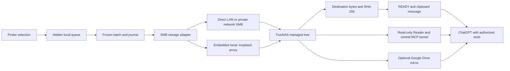

# Technical architecture / Arhitectură tehnică

[English README](../README.md) · [README în română](../README.ro.md)

## English

### Components and boundaries

| Component | Responsibility | Boundary |
| --- | --- | --- |
| Finder Quick Action | Copy selections atomically into the hidden queue and wake the app | Local macOS user session |
| Native macOS application | Menu-bar state, credentials, login preference, copy-last and process lifecycle | Swift/AppKit shell; macOS Keychain |
| Transaction engine | Stable input detection, frozen journal, classification, upload, verification, retry and clipboard | Private Python runtime; RC11 moved away from the failing PyInstaller one-file runtime |
| StorageBackend | Isolate destination operations from the transaction engine | RC14 wraps existing SMB behavior; only SMB adapter implemented |
| Embedded remote helper | Per-installation private Tailscale node and local SMB proxy | Go/tsnet; proxy binds only to loopback |
| TrueNAS | Authoritative batch storage and SMB service | SMB writer has access to the managed tree |
| TrueNAS Reader | List/find/read files and inspect ZIP members | Root-confined, read-only MCP service; no shell, upload, rename or delete tools |
| Central secure MCP tunnel | Connect the Reader to an authorized ChatGPT environment | One centrally managed tunnel; separate from SMB transport |
| Drive mirror | Optional category-preserving read fallback | Synchronization delay and connector permissions apply |
| Retention executor | Expire eligible stored batches | Separate server-side track; native 168-hour deletion validation pending |

The private runtime implementation is not included in this repository. A native application shell does not mean every internal component is compiled machine code: the recorded RC11–RC14 runtime uses Python in a virtual environment. Any future public installer must be reviewed for the owner's source-distribution restrictions as well as secrets before publication.

### Transaction mechanism

Inputs are debounced and checked for stability before a frozen journal records the batch. A persistent random device ID, UTC timestamp and random suffix distinguish simultaneous batches from different computers. Each file has a category, path, byte count and SHA-256.

Writes use a temporary `.partial-*` name and atomic promotion. Destination verification must succeed before the client accepts the batch. Already uploaded files are reused only when their identity matches. On network or partial failure, the journal and staged local inputs remain, allowing the same batch to resume. Whole-batch verification precedes local staging-file archival and clipboard publication. This is a batch acceptance guarantee; it does not promise that all NAS filenames become visible simultaneously in one filesystem-wide transaction.

Finder integration copies selected originals; subsequent queue cleanup concerns staged copies. The source files selected in Finder remain in their original locations.

### Independent routes

**Storage, reading and retention are separate layers.** A successful SMB upload does not establish that ChatGPT has a usable Reader, and a successful read does not establish that automatic retention is active. The embedded Tailscale client is an upload transport; it does not itself give cloud ChatGPT direct access to a private SMB share.

Drive mirrors the same category/date/batch hierarchy. A fresh file can be visible through direct folder traversal while global search still misses it. The clipboard carries the discovery and content-reading contract described in [PROTOCOL.md](PROTOCOL.md). It neither grants connector access nor starts an autonomous background agent.

The intended public storage-profile model separates SMB NAS, local folders and external volumes. The current adapter remains SMB-only. A local disk also requires an accessible Reader or connector; storing a file locally does not make it readable by cloud ChatGPT.

## Română

Clientul are o acțiune Finder, o interfață nativă Swift/AppKit în bara de meniu, un motor tranzacțional Python privat și un helper Go/tsnet pentru acces privat din afara LAN. RC11 a înlocuit runtime-ul PyInstaller one-file problematic cu Python într-un mediu virtual; denumirea „aplicație nativă” nu înseamnă că fiecare componentă internă este cod mașină compilat. Orice viitor installer public trebuie verificat și pentru restricția autorului privind distribuirea surselor, pe lângă verificarea datelor sensibile.

TrueNAS păstrează fișierele autoritative și oferă SMB. Reader/MCP este un serviciu central separat, exclusiv pentru citire, limitat la rădăcina configurată. Tunelul MCP central servește accesului ChatGPT, nu transferului SMB. Oglinda Google Drive este o rută opțională de citire, iar retenția este o componentă separată, încă fără validare nativă completă a ștergerii la 168 de ore.

Motorul așteaptă stabilizarea intrărilor, apoi înregistrează un lot înghețat. ID-ul combină timpul UTC, identitatea persistentă aleatorie a dispozitivului și un sufix aleatoriu. Fiecare fișier are categorie, cale, număr de octeți și SHA-256. Scrierea folosește un nume temporar `.partial-*` și promovare atomică. Fișierele existente sunt reutilizate numai după verificarea identității. Jurnalul și copiile locale pregătite rămân disponibile la erori, pentru reluarea aceluiași lot.

READY și clipboard-ul apar numai după verificarea întregului lot. Garanția privește acceptarea lotului; nu promite apariția simultană a tuturor fișierelor într-o singură tranzacție a sistemului de fișiere. Originalele selectate în Finder rămân pe loc; operațiile ulterioare locale privesc copiile din coadă.

**Stocarea, citirea și retenția sunt independente.** Transferul SMB reușit nu dovedește accesul ChatGPT la Reader. Citirea reușită nu dovedește activarea ștergerii automate. Tailscale integrat deservește transferul; nu îi oferă automat lui ChatGPT din cloud acces la un share SMB privat.

Abstracția StorageBackend din RC14 împachetează implementarea SMB existentă. Folderul local și discul extern sunt profiluri planificate, fără adaptoare implementate. Și stocarea locală ar necesita un Reader sau un conector accesibil pentru citirea din ChatGPT.
