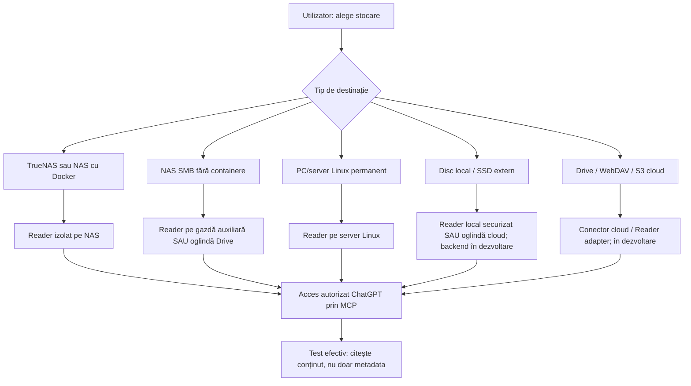

# Gazda Reader-ului și stocarea — ghid de instalare pe tipuri de hardware

[Ghidul utilizatorului](UNIVERSAL_INSTALLER.ro.md) · [Securitate](SECURITY_INSTALLER.md) · [Contractul wizardului](WIZARD_CONTRACT.md) · [Teste](ACCEPTANCE_INSTALLER.md)

**Stadiu:** proiect tehnic pentru installer universal. Singurul mediu verificat complet pentru retenție și Reader în istoricul curent este **TrueNAS-ul de referință**; nu prezentăm Synology/QNAP/Unraid/Windows/Linux/local/cloud ca deja certificate. Pachetul public RC14 nu distribuie imaginea Reader-ului și nu include wizard universal.

## 1. Înțelegerea celor trei alegeri

**A. Unde stă copia completă?** `storage_backend` — NAS, disc, cloud.  
**B. Cine îi poate citi conținutul pentru ChatGPT?** `reader_route` — Reader pe NAS/gazdă ori conector Drive.  
**C. Cine și când șterge copiile de lucru?** `retention_executor` — server, client, cloud lifecycle.

Un NAS SMB fără Docker poate servi **foarte bine ca stocare**, dar nu poate instala neapărat Reader pe el. În acest caz punem Reader pe o gazdă separată care are acces *read-only*, sau folosim o oglindă cloud configurată separat. Un disc USB poate păstra fișiere, dar ChatGPT cloud nu poate citi automat USB-ul.



## 2. TrueNAS SCALE — prima implementare pe care o dezvoltăm

**Documentație oficială pentru configurarea interfeței:** [TrueNAS SMB 25.10](https://www.truenas.com/docs/scale/25.10/scaletutorials/shares/smb/), [Custom Apps](https://apps.truenas.com/managing-apps/installing-custom-apps/) și [host-path storage](https://apps.truenas.com/getting-started/app-storage/).

### Pasul 1 — identificarea mediului

În interfața TrueNAS verifici versiunea, pool-ul disponibil, spațiul liber, politicile de snapshot/backup și dacă Apps/Docker este activ. **Nu alegi întregul pool ca rădăcină a aplicației**; TrueNAS recomandă un dataset dedicat sub pool. Afișezi numele și versiunea în raport, fără să publici adresa IP.

**Nu facem:** dezinstalare de aplicații existente, schimbare globală de ACL, deschidere automată de porturi în router ori modificarea altor foldere.

### Pasul 2 — dataset și director dedicat

În **Datasets → Add Dataset**, creezi un dataset (de exemplu `ChatGPTDrop`), distinct de backupuri, apoi un subdirector administrat `ChatGPT-Live`. Un instalator automatizat va propune numele și va cere confirmare **înainte** de a crea datasetul. Setează eventual o **cotă de spațiu pe dataset**, nu confundă cota ZFS cu tokenurile ChatGPT. Definește separat dacă snapshoturile includ sau exclud acest spațiu temporar.

**Verificare:** calea se află strict sub datasetul ales; nu este symlink către alt pool; volum disponibil și montat.

### Pasul 3 — utilizatorul SMB și ACL

În **Credentials → Users**, creezi un **cont SMB dedicat, neadministrator**, cu autentificare SMB activă și parolă unică. În **Shares → Windows (SMB) → Add** configurezi share-ul cu calea unui dataset dedicat. Ajustezi **atât ACL-ul share-ului, cât și ACL-ul sistemului de fișiere** astfel încât acel cont să poată crea/citi/redenumii în arborele administrat, nu în backupuri sau restul pool-ului. Nu folosi `root` sau acces anonim/guest.

**Verificare:** test SMB cu contul dedicat, plus un test negativ: contul **nu** poate accesa un folder intenționat situat în afara arborelui administrat. Nu modifica automat ACL-ul `builtin_users` pentru toate aplicațiile existente.

### Pasul 4 — aplicația ChatGPT Drop de pe Mac

În wizard introduci **host SMB**, **share**, **subfolder administrat**, **numele contului**; parola se păstrează doar în **Keychain**, prin interfața securizată a macOS. Testul creează un fișier unic în spațiul de probă, face operații de scriere/citire/rename și verificare SHA256, apoi curăță **numai proba**.

**Stadiu:** RC14 V8 SANITIZED este publicat pentru test, dar încă nu are wizard generic validat. În această etapă definim interfața care va înlocui presupunerile fixe ale versiunilor interne.

### Pasul 5 — Reader ca aplicație izolată

În **Apps → Discover Apps → Custom App**, TrueNAS permite configurare prin interfață sau **Install via YAML**. Pentru versiunea finală, furnizăm un **pachet Reader autorizat**, semnat/identificat prin digest și legat numai de datasetul ales, montat în container ca `/data:ro`. Acesta este proiectul de implementare, **nu** pretindem că imaginea este deja disponibilă public.

**Condiții ale aplicației:** proces non-root, filesystem container read-only, volume de date `:ro`, `cap_drop: ALL`, `no-new-privileges`, fără `privileged`, fără Docker socket, fără acces la host networking sau alte share-uri, memorie/CPU/procese/răspuns limitate. Director temporar izolat `tmpfs`; nu permite scripturi executate din arhive și respinge symlink/path traversal.

**Exemplu conceptual de politică de container** (NU este un pachet executabil fără imaginea Reader autorizată și valorile locale confirmate):

```yaml
services:
  reader:
    image: REPLACE_WITH_AUTHORIZED_READER_IMAGE_AND_PINNED_DIGEST
    user: "READER_UID:READER_GID"
    read_only: true
    cap_drop:
      - ALL
    security_opt:
      - no-new-privileges:true
    volumes:
      - /mnt/POOL/DATASET/ChatGPT-Live:/data:ro
    tmpfs:
      - /tmp:rw,noexec,nosuid,size=64m
    pids_limit: 128
    mem_limit: 512m
    restart: unless-stopped
    # No public ports here: secure tunnel must reach Reader
    # on an explicitly configured private network.
```

**IMPORTANT:** nepublicarea portului nu este suficientă dacă o altă rețea Docker îi oferă acces extern. Reader și Secure MCP Tunnel trebuie legate printr-o **rețea izolată**, iar conexiunea la ChatGPT se autorizează separat.

### Pasul 6 — un singur tunel MCP autorizat

Reader rulează pe TrueNAS, iar un **singur tunel securizat de server** îl conectează la o integrare ChatGPT acceptată. Utilizatorul aprobă accesul în contul/workspace-ul său. Dacă acea configurație nu este permisă de plan/rol, afișăm **UNAVAILABLE_IN_THIS_CHAT**, nu recomandăm să expună Reader-ul public sau să dezactiveze securitatea.

**Verificare:** în Chat-ul efectiv listezi `ChatGPT-Live` și citești un fișier text cu marker unic; instrumentele Reader nu pot crea, edita, șterge ori executa comenzi.

### Pasul 7 — oglinda Google Drive (opțional)

În TrueNAS creezi un set separat de credențiale cloud în interfața oficială, apoi **Data Protection → Cloud Sync Tasks**, direcția `PUSH`, modul `SYNC`, sursa exclusiv `ChatGPT-Live` și folderul Drive ales. NU selecta întregul pool/share. Testează apariția unui fișier, apoi ștergerea lui din oglindă. Evită inversarea direcției și `PULL` peste datele private.

**Avertisment:** `SYNC` sincronizează și ștergerile; nu reprezintă backup și poate afecta fișierele existente în folderul de destinație. Solicităm confirmarea folderului-țintă și a efectului ștergerilor.

### Pasul 8 — retenția la șapte zile

Pe server instalezi un executor separat, care șterge **numai batchuri cu ID/manifest UTC valid, create în arborele administrat și expirate**. Nu va fi introdus în Reader (care rămâne read-only). Testează mai întâi `DRY RUN`. După un `APPLY` pe lot de probă, verifici jobul Cloud Sync încheiat și dispariția fișierului din Drive.

**Stare de referință:** la 8 octombrie 2026 curățarea primului lot de batchuri vechi a raportat 31 directoare șterse și sincronizarea Drive a terminat SUCCESS. Aceasta nu certifică toate modelele TrueNAS sau alte NAS-uri.

## 3. NAS generalist: Synology, QNAP, ASUSTOR, Unraid și alte servere SMB

**Primul test:** serviciu SMB autentificat, acces la un folder dedicat, operații sigure de creare/citire/rename/SHA256.

**Apoi detectăm capacitatea serverului:**

| Situație | Unde rulează Reader-ul | Ce trebuie testat |
| --- | --- | --- |
| NAS cu Docker/OCI/Container Manager | Pe NAS, container separat read-only | Compatibilitatea imaginii cu CPU x86_64/arm64, volume/ACL, izolare și rețea, resurse |
| NAS fără containere/Apps | Pe **mini-PC/Linux/alt sistem permanent pornit** cu mount read-only la NAS | Refuz de scriere din Reader, stabilitatea montării și tunelul MCP |
| NAS doar pentru backup/fără share administrabil | Nu instalăm pe share-ul de backup | Necesită o destinație separată |
| NAS ARM slab sau sistem proprietar | Gazdă Reader separată sau fallback Drive | Performanță, memory-limit, arhive mari |
| NAS inaccesibil în afara LAN | SMB doar prin VPN/rețea privată; niciodată port 445 public | Refacere conexiune, retry/resume și ACL |

**Synology:** pe modelele compatibile [Container Manager — Project](https://kb.synology.com/en-global/DSM/help/ContainerManager/docker_project?version=7) poate instala un proiect Compose; verifică modelul și disponibilitatea pachetului în DSM.  
**QNAP/ASUSTOR/Unraid:** configurația containerelor și permisiunilor diferă cu firmware-ul; generăm pași numai după detectarea modelului și versiunea UI. Nu publicăm comenzi universal valabile fără test nativ.

**Retenția:** pe un NAS fără joburi programate, executorul poate rula pe o gazdă administrativă autorizată cu permisiuni de ștergere strict în zona temporară; **nu** adăugăm drept de ștergere Reader-ului.

## 4. Server Linux, mini-PC sau VM

1. Selectezi discul persistent și un **director dedicat** accesibil numai contului de upload, nu `/home` integral.
2. Configurezi SMB cu utilizator limitat dacă există client remote. Dacă aplicația rulează pe aceeași gazdă, un adaptor de filesystem local trebuie validat separat.
3. Instalezi Docker/Compose prin mecanismul recomandat de distribuție, numai când utilizatorul îl aprobă.
4. Reader rulează în container neprivilegiat sau rootless unde platforma permite, cu `/data:ro` și network ACL. Secretul de tunel nu intră în imagine sau în Git.
5. Instalezi un executor de retenție separat și îl testezi în dry-run; service-ul este verificat la pornire, reboot, oprire și upgrade.

**Securitate:** fără container privilegiat, fără port public inutil, fără `docker.sock` în Reader, chei în secret store ori fișiere restrictive (Docker Compose `secrets`), nu în loguri/`environment` dacă poate fi evitat.

## 5. Disc intern, SSD extern și USB — o destinație permanentă doar cât e disponibilă

**Folder intern:** selectare prin dialog de fișiere și permisiune acordată numai folderului ales; creare de folder administrat; verificare atomic rename și hash; Reader local accesibil prin tunel ori copie cloud separată. **RC14 nu implementează încă backendul.**

**SSD/USB extern:** identificare stabilă a volumului și cale revalidată la fiecare montare, păstrarea jurnalului de batch pe discul intern; dispariția discului trece în **PAUSED/RETRY**, fără crearea automată de directoare într-o cale care acum indică alt volum. După reatașare verificăm UUID/volum și identitatea datelor înainte de reluare. Executorul de retenție amână ștergerea până revine dispozitivul.

**Nu presupunem** că un Mac/PC adormit sau un SSD deconectat poate servi Reader către ChatGPT 24/7.

## 6. Stocare cloud: Google Drive, Nextcloud/WebDAV, S3 și alte servicii

### Google Drive

- **Caz actual validat în arhitectură:** TrueNAS → Cloud Sync → Drive ca **oglindă de citire**.
- **Viitor backend primar:** aplicația va avea nevoie de un adaptor Google Drive separat, OAuth prin browser oficial, scopes minime (de exemplu `drive.file` unde acoperă operațiile), identificarea folderului dedicat, upload rezilient, checksum și eliminare controlată. Un conector ChatGPT Drive nu devine automat un canal de încărcare al aplicației.
- **Verifică:** ce conectori/permisiuni sunt disponibile în conversația reală; nu pretinde acces la toate folderele prin simpla autentificare în ChatGPT.

### Nextcloud / WebDAV

- Viitor backend primar prin HTTPS WebDAV sau integrare aprobată; pentru Nextcloud extern trebuie verificate politica serverului, app password/OAuth, upload chunked, ETag/rename și posibilitatea de citire din ChatGPT printr-un conector adecvat.
- Nextcloud poate monta backenduri externe precum SMB/CIFS/S3/WebDAV; această funcționalitate **nu implică automat că ChatGPT le poate citi**.

### S3 și compatibile

- Viitor backend obiect: bucket/prefix dedicat, IAM minim, TLS, upload multipart, identity/checksum/manifest, retention lifecycle și versioning. Semantica de rename atomic SMB **nu** este presupusă pentru obiecte; folosim manifest de comitere verificat.
- Dacă bucketul are versioning/lifecycle, delete-marker nu înseamnă ștergere fizică imediată; politica utilizatorului trebuie să reflecte aceasta.

**Alte tipuri:** OneDrive, Dropbox, WebDAV generic, NFS, SFTP ori servicii noi se pot adăuga numai ca adaptoare izolate după matricea de capabilități și teste native. Nu afirmăm compatibilitate înainte de validare.

## 7. Criteriul universal de acceptare a unei noi stocări

Un backend nou intră în lista „suportat” numai dacă trece:

- scriere într-un prefix/folder dedicat fără drepturi administrative;
- verificare reală a octeților și SHA-256 la destinație (ori checksum independent citit);
- **comitere atomică** a lotului prin rename, manifest final sau echivalent verificat;
- cădere de rețea/deconectare/restart fără pierderea originalelor și a jurnalului;
- interzicerea scăpării din prefix, symlink/traversal, fișiere cu nume ostile și credențiale în log;
- citire reală din ChatGPT prin Reader/conector (dacă utilizatorul dorește analiza), nu doar upload;
- retenție și dezinstalare cu efect strict în namespace-ul administrat;
- test negativ pentru drepturi insuficiente și test separat al backup-ului/recuperării.

**Rezumat:** stocarea permanentă este independentă de durata de viață a copiilor de lucru. Un folder poate fi pe un disc persistent și totuși politica `7 zile` să îl curețe. Pentru păstrare pe termen lung se creează un alt director/dataset și o politică de backup distinctă.
