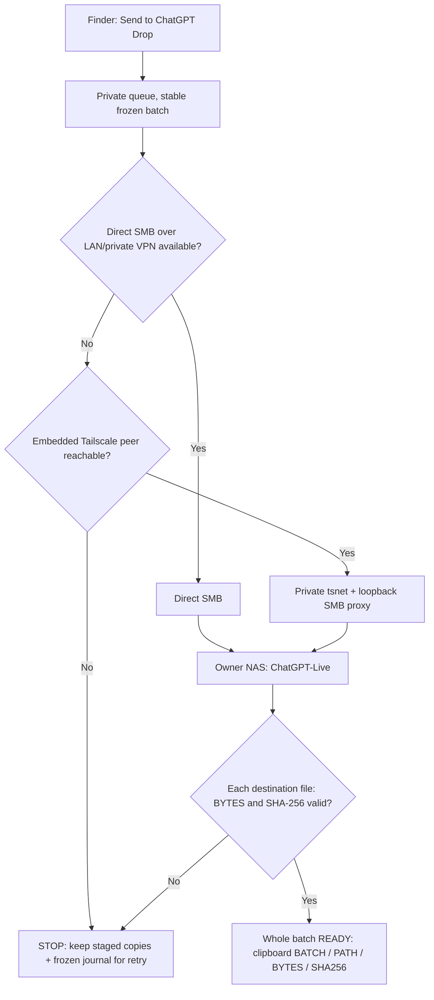
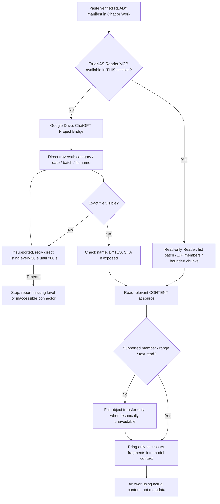
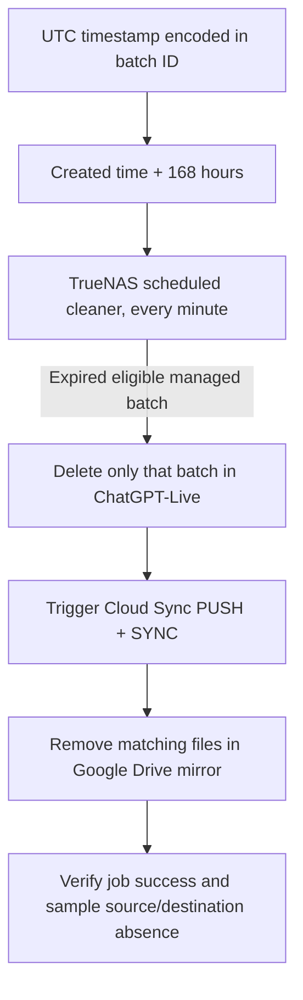

# The three routes / Cele trei trasee

**Scope:** move managed copies to storage → read selected content in Chat/Work → expire temporary copies. These are separate processes, not one continuous network tunnel.

## A. Mac → NAS: verified upload / Transfer verificat

Tailscale is a **fallback for Mac upload to the NAS**, not a cloud-to-SMB reading tunnel. Original Finder selections remain untouched. No successful whole-batch verification means no READY.

Tailscale este **rezerva de transport Mac → NAS**, nu un tunel de citire ChatGPT → Samba. Originalele din Finder rămân pe loc.

## B. NAS → Chat or Work: inspect at source / Citirea conținutului

**Important:** when translating a `ChatGPT-Live/...` path into the Drive mirror, remove only the leading `ChatGPT-Live/`. Never rely on global search alone. The 30-second/900-second interval is a **requested handoff protocol**; the current Chat, Project, Work or Codex environment may lack timers, a connected Reader, permissions or automated retry capability. Do not claim a background monitor is running unless one exists.

**Atenție:** din PATH eliminăm numai prefixul `ChatGPT-Live/` pentru Drive. `30 s / 900 s` sunt instrucțiuni de handover, nu un cronometru autonom garantat. Lipsa uneltelor/permisiunilor se raportează, nu se inventează conținut.

## C. Temporary storage → deletion / Retenția 7 zile

**Reference deployment, 8 October 2026:** retention cleaner installed, Cron job ID 6 active; initial run removed **31 expired batch directories**; Drive Cloud Sync job reported **SUCCESS**; samples disappeared from source and Drive listings. Historical empty Drive folders may remain. The policy is **not** a backup or guaranteed secure-erasure service. A durable release DMG must be stored **outside** `ChatGPT-Live` because this folder expires its contents after seven days.

**Instalarea de referință:** ștergere inițială verificată, 31 de directoare, job Drive SUCCESS. Backupurile și artefactele permanente stau în altă locație.

## Separate configuration / Configurare independentă

| Layer | Needed and validated separately |
| --- | --- |
| Upload | SMB service/account, atomic writes, destination hash; optional private Tailscale client enrollment |
| Read | TrueNAS Reader mounted `:ro`, secure authorized MCP connection **or** a supported Drive connector |
| Retention | Server-side 168h cleaner; independently configured `PUSH + SYNC` to mirrored Drive folder |

[Setup checklist](SETUP.md) · [Chat/Work handover](HANDOVER.md)
