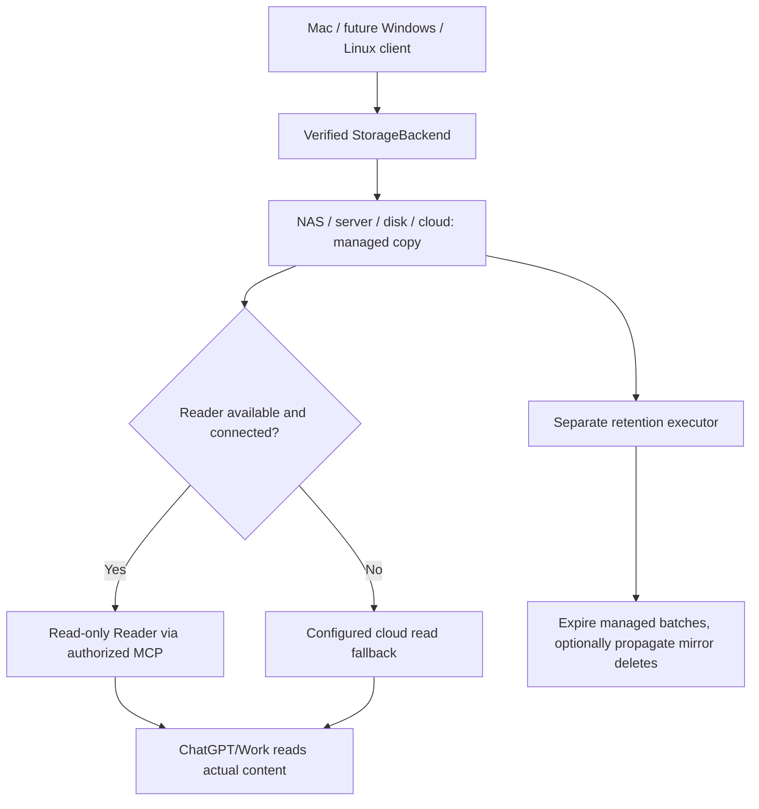

# Universal Installer — guided user journey (design v0.1)

**RC15.1 scope / Domeniu:** notarized startup/Keychain repair, not implementation of this universal-installer design. Twenty isolated repair cases passed; the separate [universal acceptance matrix](ACCEPTANCE_INSTALLER.md) remains a specification. [Current evidence / Dovezi curente](STATUS.md) · [Python requirements / Cerințe Python](COMPATIBILITY.md).

[Română — complete step-by-step manual](UNIVERSAL_INSTALLER.ro.md) · [Hardware and storage hosts](HOSTING_AND_STORAGE.md) · [Mandatory security model](SECURITY_INSTALLER.md) · [Wizard contract](WIZARD_CONTRACT.md) · [Acceptance matrix](ACCEPTANCE_INSTALLER.md)

> **As of 10 October 2026, this is a product specification, not a shipped universal installer.** The public [RC15.1 NOTARIZED PREVIEW macOS Intel prerelease](https://github.com/StefanAlMare/ChatGPT-TrueNAS/releases/tag/v0.9.0-rc15.1) lacks a tested general NAS setup wizard. A public deployable Reader package is not yet available. Do not misrepresent those capabilities as implemented.

## The user problem

Make it understandable for a newcomer to install the official ChatGPT client or use ChatGPT in a browser, install our **separate ChatGPT Drop client**, choose their own permanent storage, configure restricted credentials, install a read-only Reader when needed, authorize a connector and prove an end-to-end content read.

The goal is to **avoid repeatedly uploading whole large files into ChatGPT**. The bytes still use local/NAS/cloud capacity; retrieved content still consumes model tokens, context and tool resources. There is no promise to remove ChatGPT limits.

## The three independent paths

Tailscale/tsnet is a **private upload fallback to the same SMB NAS**, not the means by which cloud ChatGPT reads the SMB filesystem. READY means the *full upload verified*, not that a ChatGPT session has analyzed the content.

## Twelve guided screens

| Screen | User action | Mandatory proof and guard |
| --- | --- | --- |
| **0. Compatibility** | Detect OS, CPU, disk, network and available admin rights, read-only | Unsupported paths are labeled, not bypassed; no secret collection |
| **1. Official ChatGPT** | Open [chatgpt.com/download](https://chatgpt.com/download/) on macOS/Windows or [chatgpt.com](https://chatgpt.com) in a Linux browser | User signs in directly with OpenAI; ChatGPT Drop never sees passwords, MFA or cookies |
| **2. ChatGPT Drop** | Install verified native client, add Finder Quick Action (macOS first) | Validate release hash and platform signature; do not bypass Gatekeeper |
| **3. Storage choice** | Select TrueNAS, another SMB NAS, always-on Linux server, local/external disk, or future cloud backend | One active profile and a dedicated managed root; never default to entire pool/home/backup |
| **4. Credentials and probe** | Enter dedicated SMB account or backend-specific permissions | Secret stored in OS vault; test create/read/rename/SHA and reject outside-root access |
| **5. Remote upload** | Optionally enroll an embedded private Tailscale node per installation | No universal auth key; no publicly exposed SMB/445 |
| **6. Reader host** | Deploy a signed read-only Reader on a capable NAS or trusted secondary computer | UID/ACL, `:ro` mount, sandbox, capability limits and negative write/path tests |
| **7. ChatGPT read route** | Authorize supported MCP app/tunnel in the actual Chat/Work environment | An actual text-content read must work, not just service health/metadata |
| **8. Cloud fallback** | If selected, mirror to dedicated Drive folder or provision a future direct cloud connector | Minimal OAuth permissions and a real content read; mirror is a second cloud copy |
| **9. Retention** | Choose Never, 24h, 3d, 7d default suggestion, 30d or custom | Dry-run and separate consent before any deletion; exclude other storage |
| **10. Real E2E test** | Transfer harmless file and paste batch message into ChatGPT | Entire batch BYTES/SHA+READY and actual source content verified |
| **11. Finish / Recovery** | Review status and optionally enable login/startup; learn update/uninstall | Separate uninstall app, disconnect connector, revoke credentials, remove server and delete managed data |

**On every screen**, explain *Why / What changes / Security implications / Proof / Recovery*. No blind Next button, privilege escalation, broad chmod or WAN port opening.

## Which storage options can host Reader?

| Storage | Upload | Reader/read strategy | Current evidence |
| --- | --- | --- | --- |
| TrueNAS SCALE | SMB | Authorized isolated Reader container on NAS, connected by Secure MCP Tunnel; optional Drive mirror | Reference Reader and 168h cleanup tested; universal wizard **not** implemented |
| Generic SMB NAS with containers | SMB | Reader container on NAS, scoped to managed folder | Design only; per-vendor native validation needed |
| NAS without container runtime | SMB | Reader on trusted always-on host with read-only NAS mount, or cloud mirror | Design only |
| Linux PC / mini-server | SMB or future local backend | Root-confined Reader container, private tunnel | Design only |
| Mac internal / USB/external disk | Future filesystem adapter | Local Reader exposed through permitted secure tunnel or cloud mirror | Backend **not implemented in RC15.1** |
| Google Drive / Nextcloud / S3 | Future direct cloud adapters | Suitable cloud connector/Reader access with OAuth/IAM; no assumption of general ChatGPT availability | Not implemented in RC15.1 |

**An always-on NAS is not required to store a batch, but an offline local/USB disk does not automatically provide a continuously accessible Reader.** Retention must tolerate offline devices and only resume after checking stable volume identity.

## Security model in brief

The [detailed threat model](SECURITY_INSTALLER.md) defines explicit controls against accidental data disclosure, compromised SMB accounts, public SMB, shared tailnet keys, credential leaks, malicious ZIPs, reader escape, cloud oversharing, unsafe cleanup, and update failures.

**Hard boundaries:**

- Non-admin daily client; scoped storage account; separate read-only Reader, admin, tunnel and retention identities.
- macOS Keychain / Windows Credential Manager / Linux Secret Service for credentials; Docker Compose secrets when applicable; never passwords in public examples or clipboard.
- Reader read-only data mount, no Docker socket, nonroot, read-only container filesystem, cap-drop, no-new-privileges, private network, bounded responses.
- SMB only on local/private network; Tailscale enrollment per device; OAuth scopes least privilege.
- 168h batch retention is **not** backup, secure erasure or a claim that cloud trash/snapshots expire at the same time.
- All status claims trace to actual tests. Missing MCP capability means **LIMITED/UNAVAILABLE**, never silently upload the whole private archive.

## First implementation milestones

**M0 — documentation/architecture:** user walkthrough, host capability matrix, security gates and formal wizard contract (this work).  
**M1 — macOS + TrueNAS:** client-side profile editor, Keychain, scoped SMB probe and safe migration, independently tested; do not replace accepted RC13 automatically.  
**M2 — TrueNAS Reader:** authorized distributable image, safe server setup and secure MCP/Drive authorization, E2E content read.  
**M3 — generic NAS and Linux hosting:** Docker/OCI host capability tests, isolated Reader or secondary host, secure retention executor.  
**M4 — local/external storage adapters:** volume identity, atomicity, interrupted/removable-device behavior.  
**M5 — Drive/Nextcloud/S3 direct backends:** OAuth/IAM, provider-specific commit/verification and lifecycle.  
**M6 — Windows/Ubuntu clients:** native install, credentials and E2E tests; universal ZIP only after every platform passes.

The same storage and security contracts apply to all, but **there will not be one identical executable for every OS/hardware**.

## Official references

- [ChatGPT desktop installation (macOS)](https://help.openai.com/en/articles/9275200-downloading-the-chatgpt-macos-app)
- [ChatGPT Windows app](https://help.openai.com/en/articles/9982051-using-the-chatgpt-windows-app)
- [OpenAI developer mode / remote MCP and Secure MCP Tunnel](https://help.openai.com/en/articles/12584461-developer-mode-and-full-mcp-connectors-in-chatgpt)
- [TrueNAS SMB](https://www.truenas.com/docs/scale/25.10/scaletutorials/shares/smb/) / [Custom Apps](https://apps.truenas.com/managing-apps/installing-custom-apps/)
- [Docker hardening](https://docs.docker.com/reference/compose-file/services/) / [Docker secrets](https://docs.docker.com/compose/how-tos/use-secrets/)
- [Tailscale security](https://tailscale.com/docs/reference/best-practices/security)
- [Google Drive least-privilege scopes](https://developers.google.com/workspace/drive/api/guides/api-specific-auth)

This public specification contains no proprietary implementation source or user infrastructure secrets; the private development repository and the GitHub profile repository are outside the scope of these edits.
